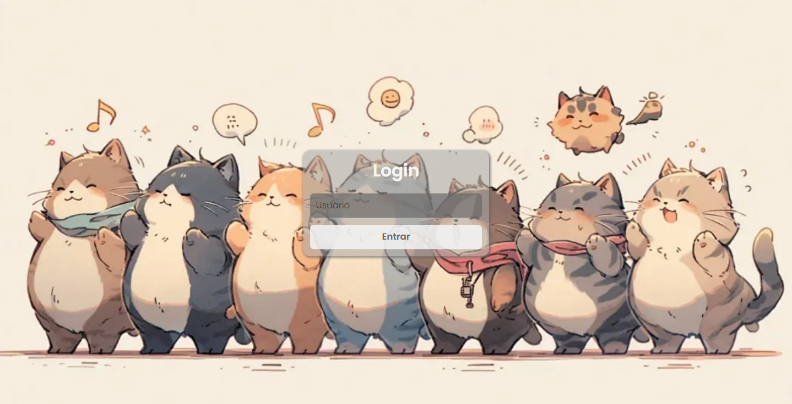

# 🐾 Feline Friends

[](https://nodejs.org/)  
[](https://developer.mozilla.org/pt-BR/docs/Web/API/WebSockets_API)  
[](#-tecnologias)  
[](https://render.com/)  

Um aplicativo de **chat em tempo real com tema felino**, desenvolvido para explorar a tecnologia de **WebSockets**.  
O projeto conta com **frontend em HTML, CSS e JavaScript puro** e **backend em Node.js**, hospedados na plataforma [Render](https://render.com/).

🔗 **Acesse o app online:** [felinefriends.onrender.com](https://felinefriends.onrender.com/)

---

## 📑 Tabela de Conteúdos
- [Introdução](#-introdução)
- [Tecnologias](#-tecnologias)
- [Instalação](#-instalação)
- [Uso](#-uso)
- [Funcionalidades](#-funcionalidades)
- [Estrutura do Projeto](#-estrutura-do-projeto)
- [Hospedagem](#-hospedagem)
- [Screenshot](#-screenshot)
- [Contribuição](#-contribuição)
- [Licença](#-licença)

---

## 🚀 Introdução
O **Feline Friends** é um chat online simples e divertido, onde usuários podem se conectar e conversar em tempo real.  
O objetivo principal do projeto é **experimentar e aprender o uso de WebSockets** para comunicação entre cliente e servidor.

---

## 🛠 Tecnologias
- **Frontend:**
  - HTML5  
  - CSS3  
  - JavaScript (puro)  

- **Backend:**
  - Node.js  
  - WebSocket (`ws`)  

---

## 📦 Instalação

Clone o repositório:

```bash
git clone https://github.com/Geemullo/feline-friends.git
cd feline-friends
```

### Backend
```bash
cd backend
npm install
npm start
```

### Frontend
Basta abrir o arquivo `index.html` do diretório `frontend` em um navegador, ou acessar o [deploy online](https://felinefriends.onrender.com/).

---

## 💻 Uso
1. Abra o frontend no navegador.  
2. Conecte-se ao servidor WebSocket.  
3. Troque mensagens em tempo real com outros usuários conectados.  

---

## ✨ Funcionalidades
- Conexão em tempo real via **WebSocket**  
- Interface simples e leve com **tema de gatos** 🐱  
- Troca de mensagens instantânea entre usuários  
- Deploy completo (frontend + backend) no **Render**  

---

## 📂 Estrutura do Projeto
```
feline-friends/
│
├── backend/        # Servidor Node.js com WebSocket
│   ├── package.json
│   └── server.js
│
├── frontend/       # HTML, CSS e JavaScript puro
│   ├── index.html
│   ├── style.css
│   └── script.js
│
└── README.md
```

---

## ☁️ Hospedagem
O projeto está hospedado na plataforma **Render**:  
- **Frontend + Backend**: [felinefriends.onrender.com](https://felinefriends.onrender.com/)  

---

## 📸 Screenshot



---

## 🤝 Contribuição
Contribuições são bem-vindas!  
Siga os passos:
1. Faça um fork do projeto  
2. Crie uma branch (`git checkout -b feature/nova-feature`)  
3. Commit suas mudanças (`git commit -m 'Adiciona nova feature'`)  
4. Faça push (`git push origin feature/nova-feature`)  
5. Abra um Pull Request  

---

## 📄 Licença
Este projeto está sob a licença MIT – sinta-se livre para usar, modificar e compartilhar.  
